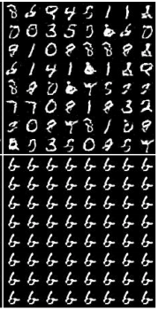

Short intro. What is it, and why we care? Outline.

## What is *mode dropping* (*mode collapse*)?

*Mode dropping* (also known as *mode collapse*) is the phenomenon where the model (i.e. GAN) disregards some modes in the data distribution and assigns them low density.[^1]

> 
>
> Figure from ["Overcoming Mode Collapse and the Curse of Dimensionality" IAS Workshop, Ke Li, 2019](https://drive.google.com/file/d/1PV4YN3OQprww4BCDwB9XWMUIz_mbdDab/view).
>
> 
>
> On bottom: samples synthesised by a GAN that suffers from mode dropping. It supposed to learn MNIST (i.e. generalise the distribution of MNIST), but due to mode dropping, the model outputs mostly the digit six (rather than all digits).[^3]
>
> 

## Why mode dropping is such a significant drawback of GANs?

A GAN that suffers from mode dropping does *not* learn (i.e. generalize) the true data distribution.[^2]

A notable consequence is that sample quality no longer reflects how well the model learns the underlying distribution.[^1]

> Mode dropping consequence: a GAN that generates high quality photorealistic images, does *not* necessarily generalised the training dataset distribution (and the *true* data distribution).
>
> 

Unfortunately, to date, we do not have reliable method to measure mode dropping. 
Visualization of samples no longer works because human memory constraints limit our ability to detect a deficiency in diversity compared to the training data. Comparison to the nearest training example is also problematic because it only detects almost exact memorization of a training example.[^1]

As a result, the "quantity" of mode dropping is typically not measured. This is dangerous, because we do not know how much "mode dropping" was given up in order to achieve an improvement in sample quality.[^1]

## Why GANs suffer from mode dropping?

### Theoretical guarantees does *not* hold in practice?

In theory it has been shown that minimising the original GAN objective *do* force the model to learn the true data distribution (which can be thought of as minimising the Jensen-Shannon divergence between ). 

How is it possible?

## A possible solution

IMLE

## References
* "On the Implicit Assumptions of GANs", Ke Li and Jitendra Malik, 2018, [https://arxiv.org/abs/1811.12402](https://arxiv.org/abs/1811.12402)
* "Implicit Maximum Likelihood Estimation", Ke Li and Jitendra Malik, 2018, https://arxiv.org/abs/1809.09087

[^1]: "On the Implicit Assumptions of GANs", Ke Li and Jitendra Malik, 2018, [https://arxiv.org/abs/1811.12402](https://arxiv.org/abs/1811.12402)
[^2]: "Overcoming Mode Collapse and the Curse of Dimensionality" IAS Workshop, Ke Li, 2019, [https://drive.google.com/file/d/1PV4YN3OQprww4BCDwB9XWMUIz_mbdDab/view](https://drive.google.com/file/d/1PV4YN3OQprww4BCDwB9XWMUIz_mbdDab/view)
[^3]:"Unrolled Generative Adversarial Networks", Luke Metz, Ben Poole and David Pfau, 2017, [https://arxiv.org/pdf/1611.02163.pdf](https://arxiv.org/pdf/1611.02163.pdf)
