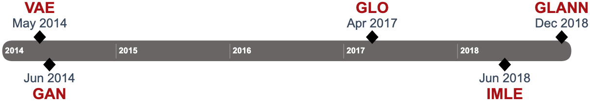
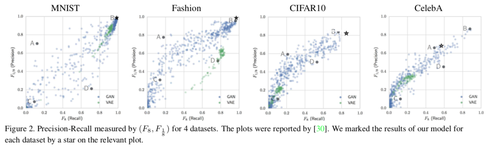
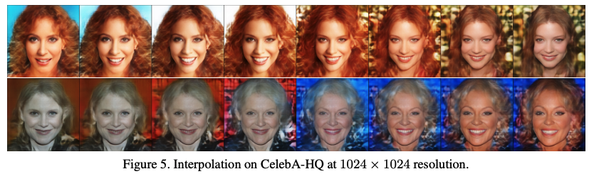
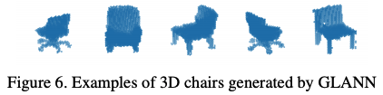
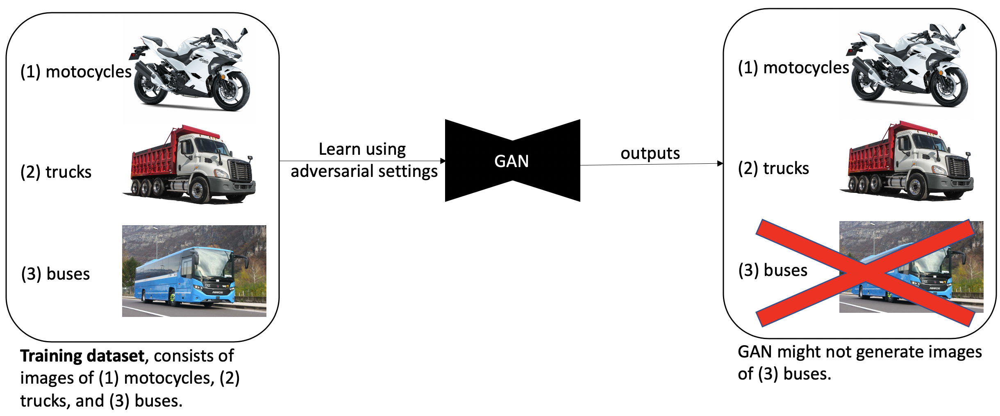

***GLANN*** is a novel method to train [generative models](https://en.wikipedia.org/wiki/Generative_model). It was shown empirically that GLANN outperform a baseline consisting of 800 [GANs]([https://en.wikipedia.org/wiki/Generative_adversarial_network](https://en.wikipedia.org/wiki/Generative_adversarial_network)) and [VAEs](https://towardsdatascience.com/understanding-variational-autoencoders-vaes-f70510919f73) on commonly used datasets. Moreover, GLANN doesn't suffer from [*mode dropping* (mode collapse) like GANs](#why-gans-suffer-from-mode-collapse), and is trained without adversarial, which makes the training process simpler and more *stable* than GANs. 

GLANN is a combination of two methods; it uses [IMLE](what-is-imle) to sample from [GLO](what-is-glo) embeddings.

GLANN was first introduced on December 2018, in a paper by Yedid Hoshen and Jitendra Malik[^9]; Later, with an additional author, Ke Li, it got published in CVPR 2019[^11].

>Empirical benchmark showed GLANN's superiority over GANs and VAEs, in both quality and diversity of the results (presented in GLANN's paper):
>
>
>
>Example of quality high-resolution outputs of GLANN:
>
>
>
>GLANN works for various tasks:
>
>

## Introduction

### Problems with Generative Adversarial Networks (GANs)

Since GANs were first introduced in 2014[^1], new implementations, methods and discoveries led to amazing improvements in the ability to generate high quality synthesised samples. For example, in computer vision, GANs succeeded to synthesise high-resolution photorealistic images and inspiring style-transfer results[^2]. Despite their popularity, **we all should think twice before choosing to use it**.

GANs suffer from three major problems[^3][^4]:

1. *Mode dropping*[^5] (AKA *mode collapse*): In practice GANs might generate only a proper subset of the desired outputs variety, ignoring modes of the underlying true data distribution.

   > Visualised explanation of **mode dropping**:
   >  
   >
   > More generally, can be visualised as[^3]:
   >

2. *Vanishing gradients*[^6]: Gradient becomes near zero when the discriminator is powerful.

3. *Training instability*: Adversarial settings require [minimax optimization](https://en.wikipedia.org/wiki/Minimax), which can only be done heuristically. It might make the training process unreproducible in practice.

In the following post we will see [*why* mode dropping may happen](#why-gans-suffer-from-mode-collapse).

### Solutions

#### A first step towards a real competitive solution (IMLE)

In the following post, we will first introduce a method from 2018 that solves all three problems mentioned above, but unfortunately in practice synthesises blurry images[^9]. This method is named *Implicit Maximum Likelihood Estimation (IMLE)*[^7].

#### A real competitive solution (GLANN)

When IMLE is combined with a different method called *GLO*[^8], the combined model, named ***GLANN***, empirically has been shown to outperform a baseline consisting of 800 GANs and VAEs on commonly used datasets[^9][^10].

> Examples of GANs generated results. Although we get high-resolution photorealistic synthesised images, we might suffer from mode dropping and a challenging unreproducible training process.
>
> 
> [StyleGAN](https://arxiv.org/pdf/1912.04958.pdf)
> 
> [pix2pixHD](https://tcwang0509.github.io/pix2pixHD/)

## Why GANs suffer from mode collapse?

## What is IMLE?

## What is GLO?

## What is GLANN?

## References

* "On the Implicit Assumptions of GANs", Ke Li and Jitendra Malik, [https://arxiv.org/abs/1811.12402](https://arxiv.org/abs/1811.12402)

[^1]: "Generative adversarial network", Wikipedia, [https://en.wikipedia.org/wiki/Generative_adversarial_network](https://en.wikipedia.org/wiki/Generative_adversarial_network)
[^2]: "Some cool applications of GAN" blogpost, Jonathan Hui, [https://medium.com/@jonathan_hui/gan-some-cool-applications-of-gans-4c9ecca35900](https://medium.com/@jonathan_hui/gan-some-cool-applications-of-gans-4c9ecca35900)
[^3]: "Overcoming the Curse of Dimensionality and Mode Collapse", Ke Li, [https://drive.google.com/file/d/1PV4YN3OQprww4BCDwB9XWMUIz_mbdDab/view](https://drive.google.com/file/d/1PV4YN3OQprww4BCDwB9XWMUIz_mbdDab/view) and [https://youtu.be/lO4HDchiegY](https://youtu.be/lO4HDchiegY)
[^4]: "Why it is so hard to train Generative Adversarial Networks" blogpost, Jonathan Hui, [https://medium.com/@jonathan_hui/gan-why-it-is-so-hard-to-train-generative-advisory-networks-819a86b3750b](https://medium.com/@jonathan_hui/gan-why-it-is-so-hard-to-train-generative-advisory-networks-819a86b3750b)
[^5]: "On the Implicit Assumptions of GANs", Ke Li and Jitendra Malik, [https://arxiv.org/abs/1811.12402](https://arxiv.org/abs/1811.12402)
[^6]: "Common Problems" of real world GANS, Google developers' Machine Learning Crash Course, [https://developers.google.com/machine-learning/gan/problems](https://developers.google.com/machine-learning/gan/problems)
[^7]: "Implicit Maximum Likelihood Estimation", Ke Li and Jitendra Malik, [https://arxiv.org/abs/1809.09087](https://arxiv.org/abs/1809.09087)
[^8]:"Optimizing the Latent Space of Generative Networks", Bojanowski et al., [https://arxiv.org/abs/1707.05776](https://arxiv.org/abs/1707.05776)
[^9]:"Non-Adversarial Image Synthesis with Generative Latent Nearest Neighbors", Yedid Hoshen and Jitendra Malik, [https://arxiv.org/abs/1812.08985](https://arxiv.org/abs/1812.08985)
[^10]:GLANN implementation in PyTorch, Yedid Hoshen, [https://github.com/yedidh/glann](https://github.com/yedidh/glann)
[^11]: "Non-Adversarial Image Synthesis with Generative Latent Nearest Neighbors", Yedid Hoshen, Ke Li and Jitendra Malik, [http://openaccess.thecvf.com/content_CVPR_2019/papers/Hoshen_Non-Adversarial_Image_Synthesis_With_Generative_Latent_Nearest_Neighbors_CVPR_2019_paper.pdf](http://openaccess.thecvf.com/content_CVPR_2019/papers/Hoshen_Non-Adversarial_Image_Synthesis_With_Generative_Latent_Nearest_Neighbors_CVPR_2019_paper.pdf)