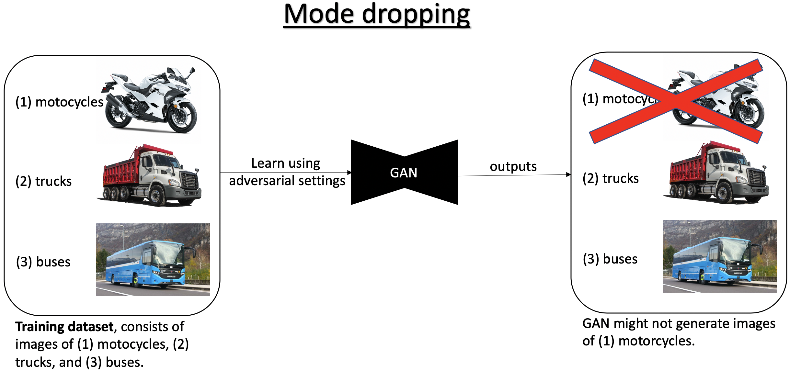
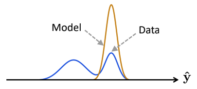
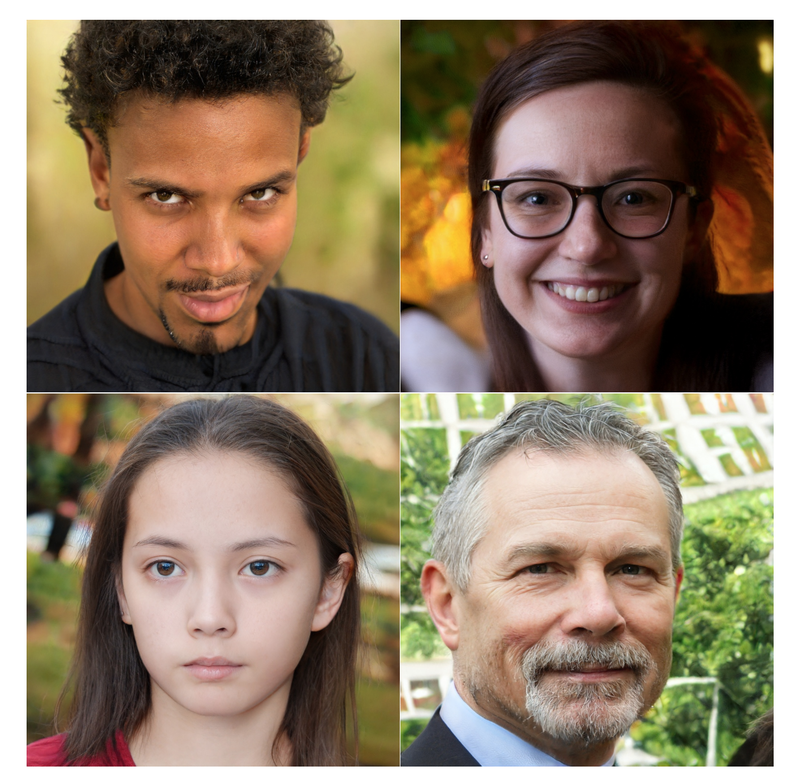

Since GANs were first introduced in 2014[^1], new implementations, methods and discoveries led to amazing improvements in the ability to generate high quality synthesised samples. For example, in computer vision, GANs succeeded to synthesise high-resolution photorealistic images and inspiring style-transfer results[^2]. Despite their popularity, **we all should think twice before choosing to use it**.

## Problems

GANs suffer from 3 major problems[^3][^4]:

* *Mode dropping*[^5] (AKA *mode collapse*): In practice GANs might generate only a limited variety of the desired outputs verity, and ignore modes of the underlying true data distribution. For example, if we want to synthesise new images of vehicles, and use a training dataset of (1) motorcycles, (2) trucks, and (3) buses; the GAN might generate only (or almost only) images of (1) motorcycles and (2) trucks (i.e. "drop" the (3) buses images examples).
* *Vanishing gradients*[^6]: Gradient becomes near zero when the discriminator is powerful.
* *Training instability*: Adversarial settings requires [minimax optimization](https://en.wikipedia.org/wiki/Minimax), which can only be done heuristically. It might make the training process unreproducible.

In the following post we will see why mode dropping may happen.

> 
>
> More generally, can be visualised as[^11]:
> 

## Solutions

### A first step towards a real competitive solution

In the following post, we will first introduce a method from 2018 that solve all three problems mentioned above, named *Implicit Maximum Likelihood Estimation (IMLE)*[^7], but unfortunately in practice synthesises blurry images[^9].

### A real competitive solution

When IMLE combined with a different method (called GLO[^8]), the combined model, named GLANN, empirically has been shown to outperform a baseline consisting of 800 GANs and VAEs on commonly used datasets[^9][^10].

> Examples for GANs generated results. Although we get high-resolution photorealistic synthesised images, we might suffer from mode dropping and a challenging unreproducible training process.
>
> 
> [StyleGAN](https://arxiv.org/pdf/1912.04958.pdf)
> 
> [pix2pixHD](https://tcwang0509.github.io/pix2pixHD/)

## Key resources

* "On the Implicit Assumptions of GANs", Ke Li and Jitendra Malik, https://arxiv.org/abs/1811.12402

[^1]: https://en.wikipedia.org/wiki/Generative_adversarial_network
[^2]: https://medium.com/@jonathan_hui/gan-some-cool-applications-of-gans-4c9ecca35900
[^3]: "Overcoming the Curse of Dimensionality and Mode Collapse" talk, Ke Li, https://youtu.be/lO4HDchiegY
[^4]: https://medium.com/@jonathan_hui/gan-why-it-is-so-hard-to-train-generative-advisory-networks-819a86b3750b
[^5]: "On the Implicit Assumptions of GANs", Ke Li and Jitendra Malik, https://arxiv.org/abs/1811.12402
[^6]: https://developers.google.com/machine-learning/gan/problems
[^7]: "Implicit Maximum Likelihood Estimation", Ke Li and Jitendra Malik, https://arxiv.org/abs/1809.09087
[^8]:"Optimizing the Latent Space of Generative Networks", Bojanowski et al., https://arxiv.org/abs/1707.05776
[^9]:Non-Adversarial Image Synthesis with Generative Latent Nearest Neighbors, Yedid Hoshen & Jitendra Malik, https://arxiv.org/abs/1812.08985
[^10]:GLANN pytorch implementation, Yedid Hoshen, https://github.com/yedidh/glann
[^11]: "Overcoming Mode Collapse and the Curse of Dimensionality" presentation, Ke Li, https://drive.google.com/file/d/1PV4YN3OQprww4BCDwB9XWMUIz_mbdDab/view