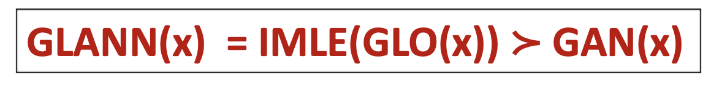

*IMLE* is a likelihood-free method to do [maximum likelihood estimation (MLE)](https://en.wikipedia.org/wiki/Maximum_likelihood_estimation) in *implicit* generative models (like [artificial neural networks](https://en.wikipedia.org/wiki/Artificial_neural_network)).

In contrast to [GANs](https://en.wikipedia.org/wiki/Generative_adversarial_network), a generative model that has been trained using IMLE does *not* suffer from: ① the [*mode dropping* (*mode collapse*) problem in GANs](/mode-dropping-problem-in-gans); ② the [*vanishing gradient* problem in GANs](/vanishing-gradient-problem-in-gans); and ③ the [training instability problem in GANs](/training-instability-problem-in-gans). In practice IMLE model synthesizes blurry images. Nevertheless, IMLE has its own strengths; it is utilised as a component of [a novel generative model that outperforms VAEs and GANs (named GLANN)](/what-is-glann).[^1]

IMLE was proposed on 2018, by Ke Li and Jitendra Malik.[^2]

## Why maximizing likelihood is a great approach?

Maximizing [likelihood](https://en.wikipedia.org/wiki/Likelihood_function) in effect *minimize a divergence measure* between the *data* distribution and the *model* distribution.[^2]
The [maximum likelihood estimator (MLE)](https://en.wikipedia.org/wiki/Maximum_likelihood_estimation) has a number of appealing properties: under mild regularity conditions, it is asymptotically [consistent](https://en.wikipedia.org/wiki/Maximum_likelihood_estimation#Consistency), [efficient](https://en.wikipedia.org/wiki/Maximum_likelihood_estimation#Efficiency) and [normal](https://en.wikipedia.org/wiki/Local_asymptotic_normality).[^2]

All of the above can explain why maximum likelihood is perhaps the standard method for estimating the parameters of a probabilistic model from observations.[^2]

## Maximum likelihood estimation (MLE) in deep learning

### Why MLE is not trivial for deep generative models (like GANs)?

Because deep generative models (neural networks like GANs) are *implicit* probabilistic models. Their likelihood function considered to be too complicated to express/evaluate.

#### *Prescribed* vs *Implicit* models

Generative models can be classified into two (not disjoint[^4]) categories:[^2]

##### *Prescribed* models

are defined by an explicit specification of the density. Therefore their unnormalized complete likelihood can be usually expressed in closed form. Examples include [mixture of Gaussians](https://en.wikipedia.org/wiki/Mixture_model#Gaussian_mixture_model), and [hidden Markov models](https://en.wikipedia.org/wiki/Hidden_Markov_model).

##### *Implicit* models

are defined most naturally in terms of a (simple) sampling procedure. Most models take the form of a deterministic parameterized transformation $T_θ(·)$ of an analytic distribution, like a Gaussian. The transformation $T_θ(·)$ often takes the form of a highly expressive function approximator, like a [neural network](https://machinelearningmastery.com/neural-networks-are-function-approximators/#:~:text=Training%20a%20neural%20network%20on,the%20intuitions%20for%20function%20approximation.). Examples include GANs.

  > Implicit models can be naturally viewed as the distribution induced by the following sampling procedure:[^2]
  >
  > 1. Sample $z ∼ N(0,I)$
  > 2. Return $x := T_θ(z)$ 

###### Likelihood of an implicit model

According to Li and Malik, in general, attempting to reduce the marginal likelihood of an implicit model to a closed-form expression is hopeless. Evaluating it numerically is also challenging, since the domain of integration could consist of an exponential number of disjoint regions and numerical differentiation is ill-conditioned.[^2]

### GANs likelihood-free learning approach: minimizing the objective will minimize an *f*-divergence between data and samples

Instead of maximizing likelihood directly, GANs took a different learning approach:

#### Learning goal

GANs are based on the idea of minimizing the distinguishability between data and samples.[^2]

#### Theoretical guarantees

It has been shown that when given access to an infinitely powerful discriminator, the GAN objective *minimizes* a few instances of [*f*-divergences](https://en.wikipedia.org/wiki/F-divergence).[^2]

#### Problems in practice

Despite the theoretical results, there are a number of challenges that arise in practice, such as ① [mode dropping/collapse](/mode-dropping-problem-in-gans), ② [vanishing gradients](vanishing-gradient-problem-in-gans) and ③ [training instability](/training-instability-problem-in-gans).[^2]

##### Why those problems occur in practice?

A number of explanations have been proposed to explain these phenomena and point out that many theoretical results rely on assumptions that does *not* holds in practice (for example, that the number of samples from the true data distribution must be infinite).[^2] For more details on those three problems, read my blogposts (link above).

## IMLE key ideas

### Likelihood-free method that maximize likelihood

As mentioned, IMLE is a likelihood-free method to do [maximum likelihood estimation (MLE)](https://en.wikipedia.org/wiki/Maximum_likelihood_estimation) in implicit generative models. Although IMLE is likelihood-free, it has been shown that IMLE is equivalent to maximizing likelihood (under some conditions).

IMLE holds when the capacity of the model is finite and the number of data examples is finite, as we expect to have in practice.[^2]

### Observation: How does maximum likelihood look like?

IMLE relies on the following observation: a model distribution that maximizes the likelihood of the data should assign high density to each of the data examples, and so if samples were drawn from the model, samples would be more likely to lie near data examples than elsewhere.[^2]

### Objective function

To make the above happen, we can simply adjust the parameters of the model so that each data example is close to some sample.

#### Formal definition

We are given a set of $n$ data examples $x_1, \ldots , x_n$ and some unknown parameterized probability distribution $P_θ$ with density $p_θ$. We also have access to an oracle that allows us to draw independent and identically distributed (i.i.d.) samples from $P_θ$. Let $\tilde{x}^θ_1,\ldots, \tilde{x}^θ_m$ be i.i.d. samples from $P_θ$, where $m \ge n$. For each data example $x_i$ , we define a random variable $R^θ_i$ to be the distance between $x_i$ and the nearest sample. More precisely,

$$
R^θ_i := \min_{j \in [m]} \|\tilde{x}^θ_j - \tilde{x}^θ_i\|_2^2
$$

The implicit maximum likelihood estimator $\hat{θ}_{IMLE}$ is defined as:

$$
\begin{split}
\hat{θ}_{IMLE} &:= \arg \min_\theta \mathbb{E}_{R^θ_1, \ldots, R^θ_n} \left[ \sum_{i=1}^n R^θ_i \right] \\
&= \arg \min_\theta \mathbb{E}_{\tilde{x}^θ_1,\ldots, \tilde{x}^θ_m} \left[ \sum_{i=1}^n \min_{j \in [m]} \|\tilde{x}^θ_j - \tilde{x}^θ_i\|_2^2 \right]
\end{split}
$$

### Algorithm

IMLE works by drawing samples from the model, finding the nearest sample to every data example and adjusting the parameters of the model so that it is closer to the data example.

In each outer iteration, we draw $m$ i.i.d. samples from the current model $P_θ$. We then randomly select a batch of examples from the dataset, and find the nearest sample from each data example. We then run a standard iterative optimization algorithm, like [stochastic gradient descent (SGD)](https://en.wikipedia.org/wiki/Stochastic_gradient_descent), to minimize a sample-based version of the IMLE objective.

> **Require:**
>     The dataset $ D=\{x_i\}_{i=1}^n $ and a sampling mechanism for the implicit model $P_\theta$.
>
> **Algorithm:**
>     Initialize $θ$ to a random vector
>     For** $k = 1$ **to** $K$ **do**
>             Draw i.i.d. samples $\tilde{x}^θ_1,\ldots, \tilde{x}^θ_m$ from $P_\theta$
>             Pick a random batch $S ⊆ \{1, \ldots , n\}$
>             $σ(i) ← \arg \min_j \|\tilde{x}^θ_i - \tilde{x}^θ_j\|_2^2, ∀i ∈ S$
>             **For** $l = 1$ **to** $L$ **do**
>                     Pick a random mini-batch $\tilde S ⊆ S$
>                     $θ ← θ − η∇_θ \left( \frac n {|\tilde S|} \sum_{i \in \tilde S} \|\tilde{x}^θ_i - \tilde{x}^θ_{\sigma(i)}\|_2^2 \right)$
>             **End for**
>     **End For**
>     **Return** $\theta$

##### Time complexity

Because the algorithm needs to solve a [nearest neighbour search](https://en.wikipedia.org/wiki/Nearest_neighbor_search) problem in each outer iteration (i.e. calculating $\sigma(i)$), the scalability of our method depends on the ability to find the nearest neighbours quickly. This was traditionally considered to be a hard problem, especially in high dimensions. However, this is no longer the case, due to recent advances in nearest neighbour search algorithms, which avoid the curse of dimensionality in time complexity that often arises in nearest neighbour search.[^2]

## IMLE vs GANs

### IMLE learning approach vs GANs learning approach

Intuitively, IMLE learning approach is the opposite of [GANs learning approach](#gans-likelihood-free-learning-approach:-minimizing-the-objective-will-minimize-an-$f$-divergence-between-data-and-samples).

GANs learning approach is to minimize the distinguishability between data and samples; It ensures that each sample is close to some data example. But some data examples may not be chosen by any sample, resulting in [mode dropping](/mode-dropping-problem-in-gans).[^2]

### Main achievements: IMLE does *not* suffer from ① mode dropping, ② vanishing gradient, and ③ training instability

In contrast to [GANs](https://en.wikipedia.org/wiki/Generative_adversarial_network), a generative model that has been trained using IMLE does *not* suffer from: ① the [*mode dropping* (*mode collapse*) problem in GANs](/mode-dropping-problem-in-gans); ② the [*vanishing gradient* problem in GANs](/vanishing-gradient-problem-in-gans); and ③ the [training instability problem in GANs](/training-instability-problem-in-gans).

① Modes are not dropped because the loss ensures each data example has a sample nearby at optimality; ② gradients do not vanish because the gradient of the distance between a data example and its nearest sample does not become zero unless they coincide; ③ training is stable because the estimator is the solution to a simple minimization problem.[^2]

## IMLE drawbacks

Unfortunately, in practice models that are trained via IMLE synthesize blurry images.[^5]

## Improvements that outperform GANs

A method that outperforms GANs use IMLE as a component (together with an additional method, called [GLO](/what-is-glo)). The method is named [GALNN](/what-is-glann).

> 

## References
* "On the Implicit Assumptions of GANs", Ke Li and Jitendra Malik, 2018, [https://arxiv.org/abs/1811.12402](https://arxiv.org/abs/1811.12402)
* "Implicit Maximum Likelihood Estimation", Ke Li and Jitendra Malik, 2018, https://arxiv.org/abs/1809.09087

[^1]: "Overcoming Mode Collapse and the Curse of Dimensionality" IAS Workshop, Ke Li, 2019, [https://drive.google.com/file/d/1PV4YN3OQprww4BCDwB9XWMUIz_mbdDab/view](https://drive.google.com/file/d/1PV4YN3OQprww4BCDwB9XWMUIz_mbdDab/view)
[^2]: "Implicit Maximum Likelihood Estimation", Ke Li and Jitendra Malik, 2018, [https://arxiv.org/abs/1809.09087](https://arxiv.org/abs/1809.09087)
[^3]: "On the Implicit Assumptions of GANs", Ke Li and Jitendra Malik, 2018, [https://arxiv.org/abs/1811.12402](https://arxiv.org/abs/1811.12402)

[^4]: Some models admit both an explicit specification of the density and a simple sampling procedure and so can be considered as both prescribed and implicit. Examples include [variational autoencoders (VAE)](https://towardsdatascience.com/understanding-variational-autoencoders-vaes-f70510919f73).[^2]
[^5]: "Non-Adversarial Image Synthesis with Generative Latent Nearest Neighbors", Yedid Hoshen and Jitendra Malik, [https://arxiv.org/abs/1812.08985](https://arxiv.org/abs/1812.08985)

